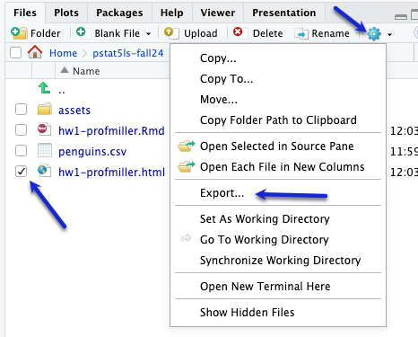
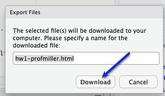

```{r setup, include=FALSE}
knitr::opts_chunk$set(echo = TRUE)
library(stats250sbi)
```

# Don't Forget to Rename your Document

To avoid your work being overwritten, **rename** this file (`hw4.Rmd`). You could add your name to the file name (e.g., `hw4-profmiller.Rmd`).

## Heights of 10-year-old Children
Heights of 10-year-old children, regardless of sex, closely follow a normal distribution with mean 55 inches and standard deviation 6 inches.

The following chunks can be used for you to calculate the answers to this question in the homework. (Hint: You have examples of using `pnorm()` and `qnorm()` in Lab 4 and in Slide Set 4.)


```{r shorterthan48, error = T}
# Use this chunk to find the probability that a randomly chosen 10-year-old is shorter than 48 inches 


```


```{r between60and65, error = T}
# Use this chunk to find the probability that a randomly chosen 10-year-old is between 60 and 65 inches 


```


```{r tallest10pct, error = T}
# Use this chunk to find the height cutoff for "very tall" if the tallest 10% of 10-year-olds are considered "very tall"


```


```{r noRide, error = T}
# The height requirement for Batman the Ride at Six Flags Magic Mountain is 54 inches. Use this chunk to find the proportion of 10-year-olds cannot go on this ride


```

<hr />

# Wrap-Up and Submission

At the top of the document, make sure you've changed the `author` field to your name (in quotes!) and the `date` field to today's date.

When you've finished your data analysis, click the **Knit** button one last time.<br />

{width="75%"}


### Submission instructions

```{=html}
<!-- This is a comment and will not show up in your document. Note that the
numbering here is all 1's. This will automatically be converted to 1, 2, etc.
when you knit the document; writing all 1's makes it so you don't have to
constantly update the numbering when you move things around in editing! -->
```
1.  In the Files pane, check the box next to your `hw3.html`: </br>

{width="50%"}

2.  Click More → Export... </br>

{width="50%"}

</br>

3.  Click Download and save the file on your computer in a folder you'll remember and be able to find later. You can just call the file `hw3-yourname.html` or whatever else you'd like (as long as you remember what you called it).

{width="50%"}

The work you did here will be used to answer Question 5 of HW 4 in Gradescope.
